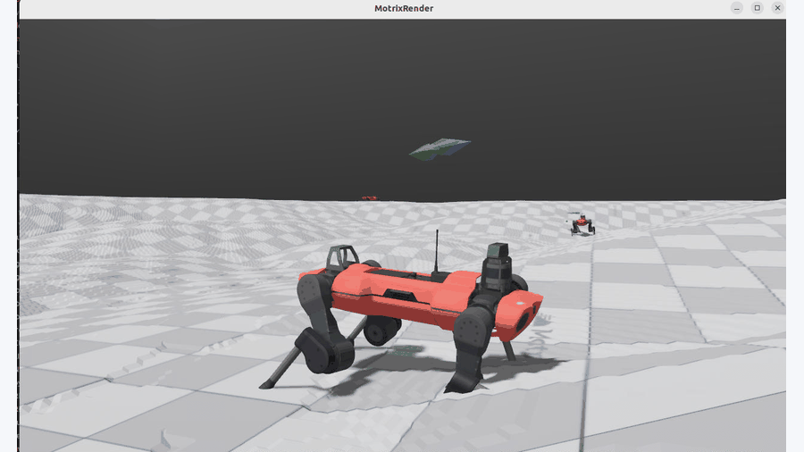
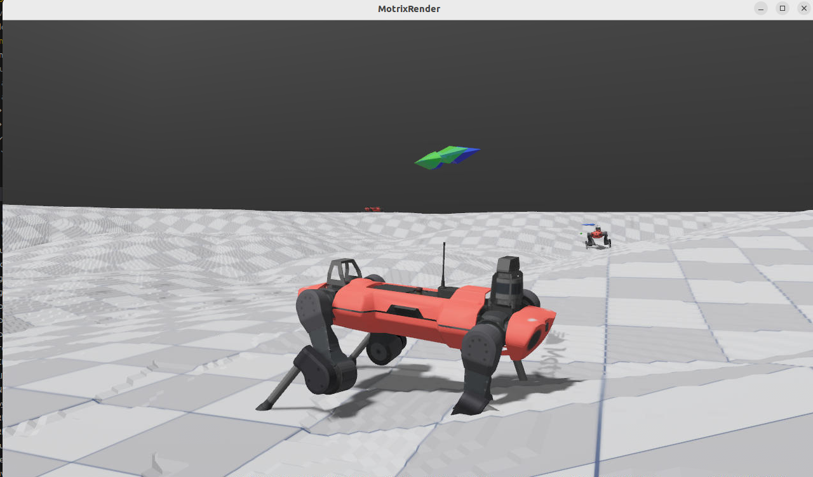
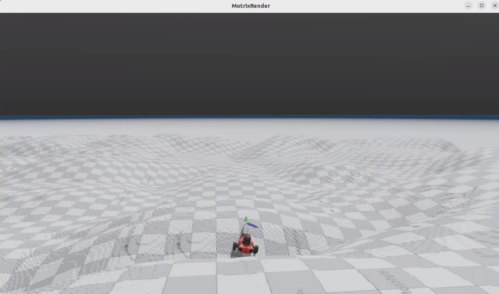
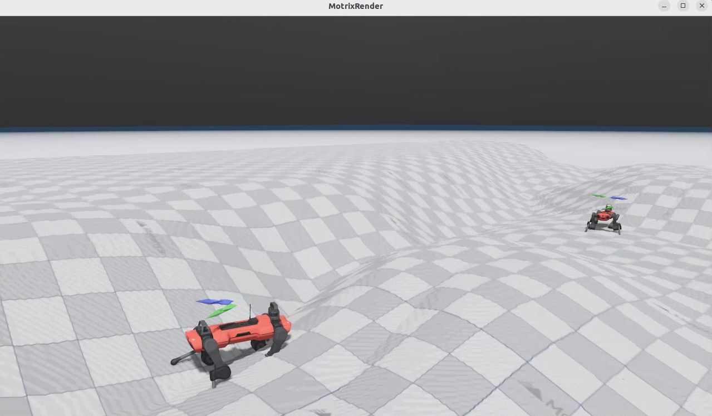
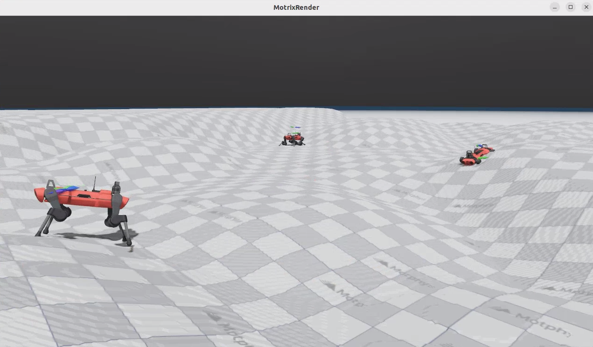
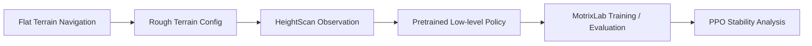

<div align="center">

# ANYmal-C Rough Terrain Navigation Transfer

### Quadruped Robot RL · Sim-to-Sim Task Migration · PPO Stability Analysis

[中文](README.zh-CN.md) · [Implementation Notes](docs/task2-implementation.md) · [Training Analysis](docs/training-analysis.md) · [Resume Bullets](docs/resume-bullets.md)


<br />



</div>

## Problem

Quadruped robots walk well on flat ground. On **rough terrain — gravel, slopes, uneven surfaces** — they fall easily. Body velocity and joint states alone are not enough; the robot needs to perceive ground height variation to adjust its gait in real time.

This project migrates the ANYmal-C quadruped navigation task from **flat terrain to rough terrain**, equipping it with HeightScan-based terrain perception and analyzing PPO training stability along the way.

> The focus is not training an RL policy from scratch, but completing a **task migration** within existing simulation frameworks (Isaac Lab / MotrixLab) — a scenario much closer to real engineering work.

## Demo

| Robot close-up | Rough terrain overview |
| --- | --- |
|  |  |

| Navigation targets | Multi-environment evaluation |
| --- | --- |
|  |  |

Full demo video: [media/anymal_c_rough_terrain_demo.mp4](media/anymal_c_rough_terrain_demo.mp4)

## Accomplishments

### Environment Adaptation

- Replaced the Isaac Lab low-level config from `AnymalCFlatEnvCfg` to `AnymalCRoughEnvCfg` for rough-terrain simulation
- Added `anymal_c_navigation_rough` task in MotrixLab with height-field terrain generation
- Kept the same navigation task interface (action/observation spaces) — a config-level migration

### Policy Transfer

- Integrated HeightScan observations for terrain-aware locomotion
- Loaded the pretrained `ANYmal-C/HeightScan/policy.pt` low-level policy
- Maintained a 12-DoF action space (joint position control) and 54-D observation space

### Training & Evaluation

- Organized training/evaluation scripts for 4096 parallel environments (train) / 64 environments (eval)
- Fully reproducible workflow — see commands below

### PPO Stability Analysis

Key observations from the training logs:

| Metric | Observation |
|--------|-------------|
| Learning rate trend | Oscillated from `2e-4` down to `2e-5`, suggesting adaptive KL-based scheduling |
| Steps 2k–6k | LR stayed above `1e-4` with strong oscillation; episode length fluctuated heavily |
| After 10k steps | LR dropped below `5e-5`; finer policy updates led to stable behavior |

**Key insight**: The policy was learning, but the adaptive learning rate kept destabilizing it with overly large updates during early-to-mid training.

**Recommendations**: Replace adaptive scheduling with linear decay; reduce initial LR from `2e-4` to `1e-4` or `5e-5`.

Detailed analysis at [docs/training-analysis.md](docs/training-analysis.md).

## Workflow



## Tech Stack

| Area | Tools |
| --- | --- |
| Robot | ANYmal-C quadruped |
| Simulation | Isaac Lab, MotrixLab, MotrixSim |
| RL algorithm | PPO (SKRL) |
| Policy adaptation | HeightScan low-level locomotion policy |
| Training tools | SKRL, TensorBoard, Python |
| Task | Rough Terrain Navigation, Target Tracking, Yaw Alignment |

## Isaac Lab Adaptation

The key change: replace the flat-terrain low-level config and load the HeightScan policy.

```python
from isaaclab_tasks.manager_based.locomotion.velocity.config.anymal_c.rough_env_cfg import (
    AnymalCRoughEnvCfg,
)

LOW_LEVEL_ENV_CFG = AnymalCRoughEnvCfg()

pre_trained_policy_action = mdp.PreTrainedPolicyActionCfg(
    asset_name="robot",
    policy_path=f"{ISAACLAB_NUCLEUS_DIR}/Policies/ANYmal-C/HeightScan/policy.pt",
    low_level_decimation=4,
    low_level_actions=LOW_LEVEL_ENV_CFG.actions.joint_pos,
    low_level_observations=LOW_LEVEL_ENV_CFG.observations.policy,
)
```

Full example: [examples/isaaclab_navigation_env_cfg_patch.py](examples/isaaclab_navigation_env_cfg_patch.py).

## Training & Evaluation

```bash
# Train (4096 parallel envs)
bash scripts/train_anymal_c_navigation_rough.bash

# Evaluate (64 envs)
bash scripts/eval_anymal_c_navigation_rough.bash
```

Raw MotrixLab commands:

```bash
uv run scripts/train.py --env anymal_c_navigation_rough --num-envs 4096
uv run ./scripts/play.py --env anymal_c_navigation_rough --num-envs 64
```

## Repository Structure

```text
.
├── README.md / README.zh-CN.md   # Bilingual project docs
├── docs/
│   ├── project-positioning.md
│   ├── task2-implementation.md
│   ├── training-analysis.md
│   └── resume-bullets.md
├── examples/
│   └── isaaclab_navigation_env_cfg_patch.py
├── scripts/
│   ├── train_anymal_c_navigation_rough.bash
│   └── eval_anymal_c_navigation_rough.bash
└── media/
```

## Resume Summary

> Migrated ANYmal-C quadruped navigation from flat terrain to rough terrain using Isaac Lab and MotrixLab, adapted a HeightScan-based low-level policy, and analyzed PPO instability caused by learning-rate oscillation, proposing smoother schedules and lower initial learning rates.

See [docs/resume-bullets.md](docs/resume-bullets.md) for full Chinese and English resume entries.

## Notes

This repository is a portfolio-oriented project showcasing task migration, framework adaptation, RL training analysis, and technical documentation. Upstream simulation frameworks and robot assets remain the property of their respective maintainers.
