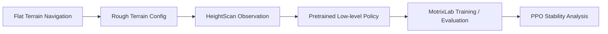

<div align="center">

# ANYmal-C 复杂地形导航迁移

### 基于 Isaac Lab 与 MotrixLab 的四足机器人强化学习结营项目

[English](README_EN.md) · [项目文档](docs/task2-implementation.md) · [训练分析](docs/training-analysis.md) · [简历描述](docs/resume-bullets.md)


<br />


</div>

## 项目简介

本项目来自线上实习结营任务，目标是将 ANYmal-C 四足机器人导航任务从平坦地形迁移到复杂地形，并完成策略适配、训练评估与调参分析。

项目不是从零实现强化学习框架，而是基于 Isaac Lab / MotrixLab 现有机器人仿真与强化学习体系，完成一个更贴近工程实习场景的任务迁移项目：读懂框架、替换配置、接入策略、整理训练脚本，并对 PPO 训练稳定性做实验分析。

> 一句话定位：基于 Isaac Lab 与 MotrixLab 完成 ANYmal-C 复杂地形导航迁移，适配 HeightScan 高度感知策略，并分析 PPO 学习率震荡导致的训练不稳定问题。

## 效果展示

### 动态预览

上方 GIF 由多段运行截图合成，用于在 GitHub 首页稳定展示复杂地形导航效果。完整视频见：

[media/anymal_c_rough_terrain_demo.mp4](media/anymal_c_rough_terrain_demo.mp4)

### 运行截图

| 近距离机器人视角 | 粗糙地形全景 |
| --- | --- |
|  |  |

| 目标方向与导航标记 | 多环境评估场景 |
| --- | --- |
|  |  |

## 我完成了什么

- 将 Isaac-navigation 中 ANYmal-C 低层环境配置从平坦地形切换为复杂地形。
- 使用 `AnymalCRoughEnvCfg` 替代原平坦地形配置。
- 接入 HeightScan 高度扫描观测，使低层策略具备地形感知能力。
- 将预训练策略路径切换到 `ANYmal-C/HeightScan/policy.pt`。
- 在 MotrixLab 中整理 `anymal_c_navigation_rough` 训练与评估命令。
- 分析 PPO 训练中自适应学习率震荡与 episode length 抖动之间的关系。
- 整理 README、任务文档、训练分析、演示图片和视频，使项目可以直接作为简历作品展示。

## 技术栈

| 模块 | 内容 |
| --- | --- |
| 机器人平台 | ANYmal-C 四足机器人 |
| 仿真框架 | Isaac Lab, MotrixLab, MotrixSim |
| 强化学习算法 | PPO |
| 策略适配 | HeightScan-based low-level locomotion policy |
| 训练工具 | SKRL, TensorBoard, Python |
| 任务类型 | Rough Terrain Navigation, Target Tracking, Yaw Alignment |

## 核心思路



复杂地形导航和普通平地导航的关键差异在于：机器人不能只依赖本体速度、关节状态和目标命令，还需要知道脚下地形的高度变化。因此，任务迁移不仅是替换地形文件，还需要同步替换低层 locomotion policy 的观测配置。

## Isaac Lab 关键改动

原任务使用平坦地形配置，迁移后切换为 rough terrain 配置，并加载 HeightScan 预训练策略：

```python
from isaaclab_tasks.manager_based.locomotion.velocity.config.anymal_c.rough_env_cfg import (
    AnymalCRoughEnvCfg,
)

LOW_LEVEL_ENV_CFG = AnymalCRoughEnvCfg()

pre_trained_policy_action = mdp.PreTrainedPolicyActionCfg(
    asset_name="robot",
    policy_path=f"{ISAACLAB_NUCLEUS_DIR}/Policies/ANYmal-C/HeightScan/policy.pt",
    low_level_decimation=4,
    low_level_actions=LOW_LEVEL_ENV_CFG.actions.joint_pos,
    low_level_observations=LOW_LEVEL_ENV_CFG.observations.policy,
)
```

完整示例见 [examples/isaaclab_navigation_env_cfg_patch.py](examples/isaaclab_navigation_env_cfg_patch.py)。

## MotrixLab 任务配置

MotrixLab 中保留平坦地形任务，同时新增复杂地形任务：

```text
anymal_c_navigation_flat
anymal_c_navigation_rough
```

粗糙地形版本继承原 ANYmal-C 导航任务配置，仅将场景文件替换为 `scene_rough.xml`。该场景使用 height-field 生成起伏地形，同时保持导航任务接口一致。

任务实现说明见 [docs/task2-implementation.md](docs/task2-implementation.md)。

## 训练与评估

训练复杂地形导航任务：

```bash
bash scripts/train_anymal_c_navigation_rough.bash
```

评估训练后的策略：

```bash
bash scripts/eval_anymal_c_navigation_rough.bash
```

原始 MotrixLab 命令：

```bash
uv run scripts/train.py --env anymal_c_navigation_rough --num-envs 4096
uv run ./scripts/play.py --env anymal_c_navigation_rough --num-envs 64
```

## 训练分析

训练过程中，学习率从约 `2e-4` 震荡衰减到 `2e-5`，表现出基于 KL divergence 的自适应调整特征。在 2k-6k 步附近，学习率仍高于 `1e-4` 且波动明显，PPO 更新步长偏大，容易破坏已经初步成型的策略，因此 episode length 出现抖动。

当训练推进到约 10k 步后，学习率降低至 `5e-5` 以下，策略更新更细，性能波动逐渐减弱。

优化建议：

- 将自适应学习率改为更平滑的线性衰减。
- 将初始学习率从 `2e-4` 降至 `1e-4` 或 `5e-5`。
- 同时观察 learning rate、KL divergence、episode length、reward 和 termination statistics。

详细分析见 [docs/training-analysis.md](docs/training-analysis.md)。

## 仓库结构

```text
.
├── README.md
├── README_EN.md
├── docs/
│   ├── project-positioning.md
│   ├── task2-implementation.md
│   ├── training-analysis.md
│   └── resume-bullets.md
├── examples/
│   └── isaaclab_navigation_env_cfg_patch.py
├── scripts/
│   ├── train_anymal_c_navigation_rough.bash
│   └── eval_anymal_c_navigation_rough.bash
└── media/
    ├── anymal_rough_terrain_preview.gif
    ├── anymal_c_rough_terrain_demo.mp4
    ├── robot_closeup.png
    ├── rough_terrain_overview.png
    ├── navigation_targets.png
    └── multi_env_evaluation.png
```

## 简历项目描述

> 基于 Isaac Lab 与 MotrixLab 完成 ANYmal-C 四足机器人复杂地形导航迁移，将平坦地形导航任务适配至 Rough Terrain 场景，接入 HeightScan 高度感知策略，并分析 PPO 训练中学习率震荡导致的策略不稳定问题，提出线性衰减和降低初始学习率等优化方案。

更多中英文简历 bullet 见 [docs/resume-bullets.md](docs/resume-bullets.md)。

## 说明

本仓库是基于线上实习结营项目整理出的作品集版本，重点展示任务迁移、环境适配、训练分析和项目文档化能力。上游仿真框架、机器人资产和相关工具归其原维护者所有。
