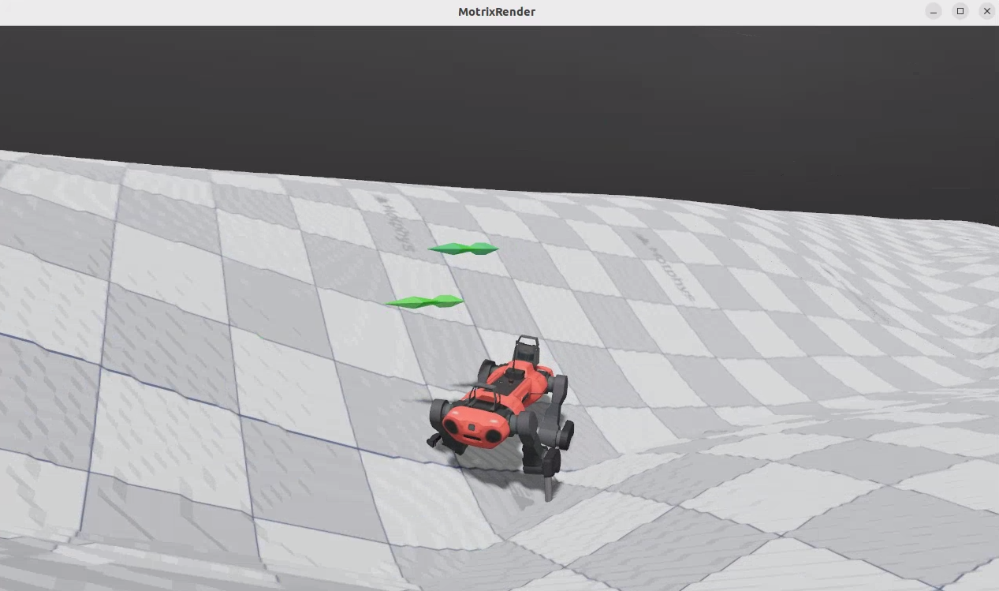

# ANYmal-C Rough Terrain Navigation Transfer


基于 Isaac Lab 与 MotrixLab 的 ANYmal-C 四足机器人复杂地形导航迁移项目。项目来自线上实习结营任务，重点展示机器人强化学习任务迁移、复杂地形适配、策略加载、训练评估与调参分析能力。



## Project Overview

This project explores sim-to-sim task transfer for quadruped robot navigation. It migrates the ANYmal-C navigation task from flat terrain to rough terrain, adapts the low-level locomotion policy to a HeightScan-based controller, and analyzes PPO training instability caused by adaptive learning-rate oscillation.

中文定位：

> 基于 Isaac Lab / MotrixLab 现有机器人仿真与强化学习框架，完成 ANYmal-C 导航任务从平坦地形到复杂地形的迁移、策略适配、训练评估和优化分析。

## Highlights

- Migrated ANYmal-C navigation from flat terrain to rough terrain.
- Replaced flat locomotion configuration with rough-terrain configuration.
- Adapted the low-level policy to a HeightScan-based pretrained controller.
- Added MotrixLab rough-terrain training and evaluation scripts.
- Analyzed PPO training instability caused by high and oscillating adaptive learning rates.
- Proposed smoother training settings such as linear learning-rate decay and lower initial learning rate.
- Organized implementation notes, experiment results, screenshots, and demo video for reproducible project presentation.

## Technical Stack

- Robot: ANYmal-C quadruped robot
- Simulation: Isaac Lab, MotrixLab, MotrixSim / MuJoCo-style scene assets
- Learning algorithm: PPO
- Policy adaptation: HeightScan-based low-level locomotion policy
- Training tools: SKRL, TensorBoard, Python
- Task type: rough terrain navigation, target-position tracking, yaw alignment

## Key Implementation

### Isaac Lab Rough Terrain Adaptation

The Isaac-navigation task was adapted from a flat-terrain low-level configuration to a rough-terrain configuration:

```python
from isaaclab_tasks.manager_based.locomotion.velocity.config.anymal_c.rough_env_cfg import (
    AnymalCRoughEnvCfg,
)

LOW_LEVEL_ENV_CFG = AnymalCRoughEnvCfg()

pre_trained_policy_action = mdp.PreTrainedPolicyActionCfg(
    asset_name="robot",
    policy_path=f"{ISAACLAB_NUCLEUS_DIR}/Policies/ANYmal-C/HeightScan/policy.pt",
    low_level_decimation=4,
    low_level_actions=LOW_LEVEL_ENV_CFG.actions.joint_pos,
    low_level_observations=LOW_LEVEL_ENV_CFG.observations.policy,
)
```

See [examples/isaaclab_navigation_env_cfg_patch.py](examples/isaaclab_navigation_env_cfg_patch.py).

### MotrixLab Rough Terrain Task

The MotrixLab task registers two environment variants:

- `anymal_c_navigation_flat`
- `anymal_c_navigation_rough`

The rough-terrain variant points to `scene_rough.xml`, which uses a height-field terrain while preserving the same robot task interface.

Relevant local implementation paths from the original task package:

- `motrix_envs/src/motrix_envs/navigation/anymal_c/cfg.py`
- `motrix_envs/src/motrix_envs/navigation/anymal_c/anymal_c_np.py`
- `motrix_envs/src/motrix_envs/navigation/anymal_c/xmls/scene_rough.xml`
- `train_eval_scripts/anymal_c_navigation_rough/train.bash`
- `train_eval_scripts/anymal_c_navigation_rough/eval.bash`

## Training and Evaluation

Train the rough-terrain navigation task:

```bash
bash scripts/train_anymal_c_navigation_rough.bash
```

Evaluate the trained policy:

```bash
bash scripts/eval_anymal_c_navigation_rough.bash
```

Original MotrixLab commands:

```bash
uv run scripts/train.py --env anymal_c_navigation_rough --num-envs 4096
uv run ./scripts/play.py --env anymal_c_navigation_rough --num-envs 64
```

## Experiment Analysis

During training, the learning rate showed a strong oscillating decay pattern, dropping from about `2e-4` to `2e-5`. The behavior indicates an adaptive schedule driven by KL divergence. In the early phase, especially around the 2k-6k step interval, the learning rate remained high and unstable, which made PPO updates too aggressive and caused episode-length fluctuation.

After about 10k steps, the learning rate decayed below `5e-5`, allowing the policy to converge more smoothly around a stable solution.

Optimization suggestions:

- Replace adaptive learning-rate scheduling with standard linear decay for smoother optimization.
- Reduce the initial learning rate from `2e-4` to `1e-4` or `5e-5` for short training runs.
- Track episode length, reward, KL divergence, and learning rate together instead of reading a single metric in isolation.

More details are in [docs/training-analysis.md](docs/training-analysis.md).

## Results

Demo video:

[media/anymal_c_rough_terrain_demo.mp4](media/anymal_c_rough_terrain_demo.mp4)

The project includes screenshots and demo footage showing ANYmal-C running in rough-terrain navigation scenes. Model checkpoints are treated as experiment artifacts and are intentionally not committed by default.

## Repository Structure

```text
.
├── README.md
├── docs/
│   ├── project-positioning.md
│   ├── task2-implementation.md
│   ├── training-analysis.md
│   └── resume-bullets.md
├── examples/
│   └── isaaclab_navigation_env_cfg_patch.py
├── scripts/
│   ├── train_anymal_c_navigation_rough.bash
│   └── eval_anymal_c_navigation_rough.bash
└── media/
    ├── rough_terrain_demo.png
    └── anymal_c_rough_terrain_demo.mp4
```

## Resume Summary

> 基于 Isaac Lab 与 MotrixLab 完成 ANYmal-C 四足机器人复杂地形导航迁移，将平坦地形导航任务适配至 Rough Terrain 场景，接入 HeightScan 高度感知策略，并分析 PPO 训练中学习率震荡导致的策略不稳定问题，提出线性衰减和降低初始学习率等优化方案。

More polished resume bullets are available in [docs/resume-bullets.md](docs/resume-bullets.md).

## Notes

This repository is packaged as a portfolio-friendly project derived from an online internship final task. It focuses on task migration, environment adaptation, experiment analysis, and documentation. The upstream simulation frameworks and robot assets remain the property of their respective maintainers.
