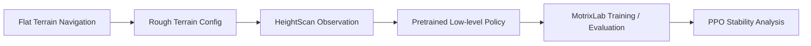

<div align="center">

# ANYmal-C Rough Terrain Navigation Transfer

### A quadruped robot reinforcement-learning project with Isaac Lab and MotrixLab

[中文](README.md) · [Implementation Notes](docs/task2-implementation.md) · [Training Analysis](docs/training-analysis.md) · [Resume Bullets](docs/resume-bullets.md)


<br />


</div>

## Overview

This repository packages an online-internship final project into a portfolio-friendly GitHub project. The project transfers ANYmal-C quadruped navigation from flat terrain to rough terrain, adapts a HeightScan-based low-level locomotion policy, and analyzes PPO training instability caused by adaptive learning-rate oscillation.

The project is not presented as a reinforcement-learning framework built from scratch. Its focus is engineering-oriented task migration: understanding the existing Isaac Lab / MotrixLab stack, changing the environment configuration, adapting the policy interface, organizing training/evaluation scripts, and explaining the training behavior.

## Demo

The GIF above is generated from evaluation screenshots for reliable rendering on GitHub. The full MP4 demo is available here:

[media/anymal_c_rough_terrain_demo.mp4](media/anymal_c_rough_terrain_demo.mp4)

| Robot close-up | Rough-terrain overview |
| --- | --- |
|  |  |

| Navigation markers | Multi-environment evaluation |
| --- | --- |
|  |  |

## Highlights

- Migrated ANYmal-C navigation from flat terrain to rough terrain.
- Replaced the flat low-level locomotion config with `AnymalCRoughEnvCfg`.
- Adapted the policy interface to HeightScan observations.
- Loaded the pretrained `ANYmal-C/HeightScan/policy.pt` low-level locomotion policy.
- Organized MotrixLab training and evaluation scripts for `anymal_c_navigation_rough`.
- Analyzed PPO instability caused by high and oscillating adaptive learning rates.
- Packaged implementation notes, training analysis, screenshots, and video into a resume-ready GitHub repository.

## Technical Stack

| Area | Tools |
| --- | --- |
| Robot | ANYmal-C quadruped robot |
| Simulation | Isaac Lab, MotrixLab, MotrixSim |
| RL algorithm | PPO |
| Policy adaptation | HeightScan-based low-level locomotion policy |
| Training tools | SKRL, TensorBoard, Python |
| Task | Rough Terrain Navigation, Target Tracking, Yaw Alignment |

## Core Workflow



Rough-terrain navigation differs from flat-ground navigation because the robot must react to terrain height variation. The transfer therefore requires more than changing the terrain file: the low-level locomotion policy and its observation interface must also be aligned with HeightScan-based perception.

## Isaac Lab Adaptation

The key Isaac Lab change is to replace the flat-terrain low-level configuration with the rough-terrain configuration and load the HeightScan policy:

```python
from isaaclab_tasks.manager_based.locomotion.velocity.config.anymal_c.rough_env_cfg import (
    AnymalCRoughEnvCfg,
)

LOW_LEVEL_ENV_CFG = AnymalCRoughEnvCfg()

pre_trained_policy_action = mdp.PreTrainedPolicyActionCfg(
    asset_name="robot",
    policy_path=f"{ISAACLAB_NUCLEUS_DIR}/Policies/ANYmal-C/HeightScan/policy.pt",
    low_level_decimation=4,
    low_level_actions=LOW_LEVEL_ENV_CFG.actions.joint_pos,
    low_level_observations=LOW_LEVEL_ENV_CFG.observations.policy,
)
```

See [examples/isaaclab_navigation_env_cfg_patch.py](examples/isaaclab_navigation_env_cfg_patch.py).

## MotrixLab Task

The MotrixLab task keeps the flat-terrain version and adds a rough-terrain variant:

```text
anymal_c_navigation_flat
anymal_c_navigation_rough
```

The rough-terrain variant inherits the original ANYmal-C navigation task and switches the scene to `scene_rough.xml`, which uses a height-field terrain while keeping the same task interface.

See [docs/task2-implementation.md](docs/task2-implementation.md).

## Training and Evaluation

Train:

```bash
bash scripts/train_anymal_c_navigation_rough.bash
```

Evaluate:

```bash
bash scripts/eval_anymal_c_navigation_rough.bash
```

Original MotrixLab commands:

```bash
uv run scripts/train.py --env anymal_c_navigation_rough --num-envs 4096
uv run ./scripts/play.py --env anymal_c_navigation_rough --num-envs 64
```

## Training Analysis

The learning rate decayed from around `2e-4` to `2e-5` with noticeable oscillation, suggesting an adaptive schedule driven by KL divergence. Around the 2k-6k step interval, the learning rate stayed above `1e-4` and fluctuated strongly. For PPO, this can make policy updates too aggressive and destabilize an already emerging locomotion strategy.

After about 10k steps, the learning rate dropped below `5e-5`, allowing finer policy updates and smoother behavior.

Optimization suggestions:

- Replace adaptive learning-rate scheduling with smoother linear decay.
- Reduce the initial learning rate from `2e-4` to `1e-4` or `5e-5`.
- Track learning rate, KL divergence, episode length, reward, and termination statistics together.

See [docs/training-analysis.md](docs/training-analysis.md).

## Repository Structure

```text
.
├── README.md
├── README_EN.md
├── docs/
├── examples/
├── scripts/
└── media/
```

## Resume Summary

Migrated ANYmal-C quadruped navigation from flat terrain to rough terrain using Isaac Lab and MotrixLab, adapted a HeightScan-based low-level policy, and analyzed PPO instability caused by learning-rate oscillation, proposing smoother schedules and lower initial learning rates.

## Notes

This repository is a portfolio-oriented package derived from an online internship final project. It focuses on task migration, environment adaptation, experiment analysis, and project documentation. Upstream simulation frameworks and robot assets remain the property of their respective maintainers.
